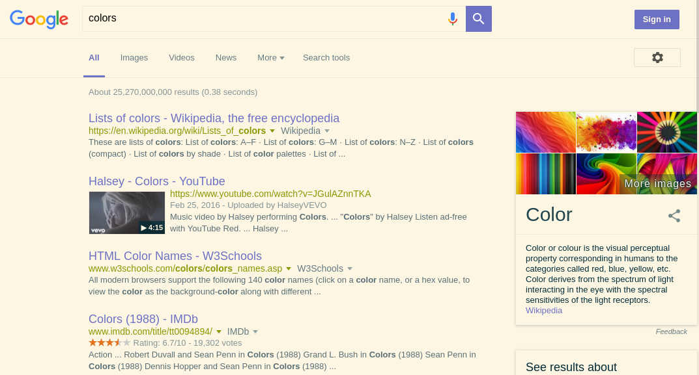

# ColorCast
Extension which lets you change the color of the Web with the colors your like!  
ColorCast - allows you to change automatically the colors used in any Web page you visit with the colors you want.

Example recoloring of google (the used colors are [solarized](http://ethanschoonover.com/solarized))



## Installation instructions
### Firefox
You could install ReColor from here: <https://addons.mozilla.org/en-US/firefox/addon/recolor/>.

## Configuration instructions
### GUI Configuration
You could configure the extension colors through its options in the extensions page,
just don't forget to save them by clicking the save button.

### Advanced configuration
If you want more advanced configuration you have to load the extension in
developer mode (from the directory `extension`) and then modify `config.js` as you wish
and reload the extension.

### User style bookmarklet
If you want to get the generated CSS from ColorCast,
so you could used it like a userstyle, use this bookmarklet:
```javascript
javascript:(function(){var a,b;a=function(a){var b,c;return b=new Blob([a.text],{type:"text/plain"}),c=document.createElement("a"),c.href=window.URL.createObjectURL(b),c.download=a.name,document.body.appendChild(c),c.click(),setTimeout(function(){return c.remove()},1e3)},b=function(){return Array.from(document.querySelectorAll("#recolor > style")).map(function(a){return a.textContent}).join("\n")},a({name:document.domain+".userstyle.css",text:b()})}).call(this);
```

## Known limitations
The extension is definitely not perfect.
It doesn't support the `@import` rule and inline styles.

